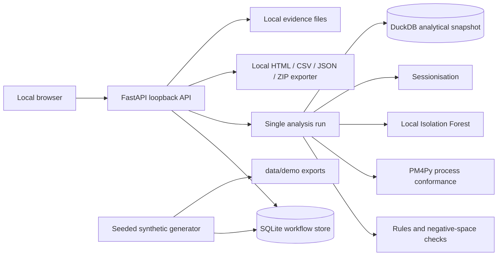

# PRAHARI-SAT-SA

## Supervisory Analytics Tool for SOC Assessment

PRAHARI-SAT-SA is a locally deployed, offline dashboard for reviewing periodic SOC submissions from Critical Sector Entities (CSEs). It helps a supervisor inspect evidence gaps, workflow execution, monitoring coverage, peer context, case-shape outliers, and follow-up decisions.

The interface is intentionally formal and government-dashboard inspired: controlled navy, saffron, white and green accents; clear assessment scope; visible data-quality limitations; and human review at the centre of every conclusion.

> **Synthetic demonstration data:** all included records, entity names, indicators, findings and evaluation fixtures are synthetic. They are not official NCIIPC data, an official compliance assessment, or proof of real-world detection effectiveness.

## What the prototype does

- Imports approved periodic packages in CSV, JSON, JSONL and read-only SQLite formats.
- Validates allowlisted tables, row shapes, duplicate IDs, completeness and references.
- Keeps source lineage through table names, record IDs and submission versions.
- Separates execution-gap candidates, negative-space/coverage gaps, uncertain signals and data-attention items.
- Checks required investigation steps, escalation evidence and monitoring expectations.
- Runs PM4Py reference-workflow alignment diagnostics on case traces.
- Runs a local Isolation Forest case-shape model with feature sensitivity explanations.
- Creates event sessions using a versioned 30-minute inactivity policy.
- Adds offline threat-context and ATT&CK-style reference mappings.
- Provides entity, finding, data-quality, analysis-run, report and audit views.
- Records supervisor decisions without overwriting the original machine finding.
- Exports HTML, CSV, JSON and a ZIP evidence bundle with hashes.
- Blocks uploaded packages before parsing when a local antivirus scanner is unavailable or does not clear the package.

## Architecture



### Runtime components

| Component | Location | Purpose |
|---|---|---|
| Local API and UI host | `backend/serve.py` | Authentication, dashboard API, import validation, review decisions, exports and static frontend serving |
| Transactional store | `data/demo.sqlite` | Users, submissions, runs, findings, decisions, sessions and audit history |
| Analytical snapshot | `data/demo.duckdb` | Batch assessment summary written after a completed run |
| Synthetic generator | `generator/build.py` | Reproducible source tables and manifests from a fixed seed |
| Analytics worker | `analytics/run.py` | Rules, negative-space analysis, peer checks, PM4Py alignment, case model and sessions |
| Dashboard | `frontend/src/main.jsx`, `frontend/src/style.css` | Responsive supervisor interface |
| Configuration | `configs/` | Policy thresholds, offline mappings and process reference |

The browser and API run on loopback. There is no cloud database, hosted AI API, Internet polling, remote font dependency or continuous collector.

## Repository artifacts

```text
157_proto/
├── README.md
├── requirements.txt
├── backend/
│   ├── serve.py                 # FastAPI API, auth, import, review, reports
│   └── __init__.py
├── analytics/
│   ├── run.py                   # Assessment engines and evidence-linked findings
│   └── __init__.py
├── generator/
│   ├── build.py                 # Seeded synthetic dataset generator
│   └── __init__.py
├── configs/
│   ├── policy.json              # Demo thresholds and completeness policy
│   ├── attack_reference.json    # Frozen synthetic threat/coverage mappings
│   └── process_reference.json   # Approved reference workflow
├── data/
│   ├── demo.sqlite              # Main runnable database
│   ├── demo.duckdb              # Analytical snapshot
│   ├── demo/                    # CSV source exports and manifest
│   └── prahari.sqlite*          # Earlier development database files
├── evaluation_private/
│   └── ground_truth_scenarios.jsonl # Evaluation-only labels; keep out of exports
├── frontend/
│   ├── src/main.jsx             # Dashboard components and routes
│   ├── src/style.css            # Dashboard visual system
│   ├── public/favicon.svg       # Project favicon
│   ├── package.json             # Frontend scripts and dependencies
│   └── vite.config.js           # Frontend build configuration
├── releases/wheels/             # Offline Python dependency wheels
├── scripts/                     # Reserved for operational launch/backup scripts
└── tests/                       # Reserved for acceptance fixtures
```

## Dataset description

The included `smoke` pack is generated with seed `42` for fast demonstrations:

| Dataset item | Count |
|---|---:|
| Synthetic CSE entities | 6 |
| Assets | 60 |
| Daily telemetry summaries | 5,400 |
| Alerts | 3,000 |
| Cases | 600 |
| Investigation steps | 597 |
| Workflow events | 1,797 |
| Escalation records | 34 |
| Remediation records | 99 |
| Pseudonymous source users | 30 |
| Threat-context fixtures | 2 |
| Vulnerability-context fixtures | 1 |

The demonstration period is 3 June 2026 to 31 August 2026 for the smoke pack. The generator also supports a larger `demo` configuration with 36 entities, 15 assets per entity and a longer assessment period.

### Source tables

- `entities.csv`: sector, size band, SOC model and operating schedule.
- `assets.csv`: asset type, criticality, source and effective dates.
- `controls.csv`: monitoring controls and expected sources.
- `monitoring_expectations.csv`: expected cadence and policy basis.
- `telemetry_daily.csv`: daily event and heartbeat summaries, including explicit zero and approved inactivity.
- `alerts.csv`: alert category, severity, timestamps, disposition and pseudonymous source user.
- `cases.csv`: case lifecycle, severity, closure and team.
- `case_alert_links.csv`: case-to-alert relationships.
- `investigation_steps.csv`: investigation activity, notes and evidence references.
- `escalations.csv`: escalation lifecycle and decision.
- `remediations.csv`: corrective action status and verification reference.
- `source_users.csv` and `record_user_links.csv`: pseudonymous operational identities, separate from application logins.
- `workflow_events.csv`: ordered case activities for process conformance.
- `threat_context.csv`: inert synthetic offline indicator/context fixtures.
- `vulnerability_context.csv`: synthetic applicability context.
- `service_context.csv`: approved maintenance/inactive periods.
- `policy_requirements.csv`, `teams.csv` and `coverage_mappings.csv`: reference expectations and denominators.
- `submission_manifest.json`: seed, period, table counts, generator version and file hashes.

The evaluation-only `evaluation_private/ground_truth_scenarios.jsonl` is kept separate from normal application inputs. It must not be used to manufacture dashboard scores or ordinary exports.

## Analytics and findings

The baseline engines produce explainable candidate findings:

1. **Process conformance** — identifies missing required activities such as `investigate` in completed traces. PM4Py alignment output is stored with the finding.
2. **Escalation checks** — identifies critical cases without a linked escalation record in the searched submission scope.
3. **Premature closure** — combines fast closure with missing investigation evidence.
4. **Monitoring gaps** — distinguishes explicit zero heartbeat days from approved inactive periods and unknown data.
5. **Case-shape outliers** — uses an Isolation Forest over operational case features. The percentile is an unusualness indicator, not a probability of weak handling.
6. **Peer comparison** — uses exposure-normalised alert rates and suppresses peer-based priority when the comparable group is too small.
7. **Sessionisation** — groups alert records by CSE, asset, source and optional source user using a 30-minute inactivity threshold.

Every finding stores its run ID, entity, related asset/case, family, observed values, expected/comparison values, evidence references, confidence label, alternative explanation and suggested review action.

## Run the project

### 1. Open the project

If you copied it to the Desktop:

```bash
cd ~/Desktop/157_proto
```

Otherwise use the project directory containing this README.

### 2. Install Python dependencies

The project includes a virtual environment in the packaged copy. If it is missing or you are setting up a clean machine:

```bash
python3 -m venv .venv
source .venv/bin/activate
python -m pip install -r requirements.txt
```

For an offline install using the bundled wheels:

```bash
python -m pip install --no-index --find-links releases/wheels -r requirements.txt
```

### 3. Build the frontend

Node.js is required for the first frontend build:

```bash
cd frontend
npm install
npm run build
cd ..
```

### 4. Start the dashboard

```bash
source .venv/bin/activate
python backend/serve.py --host 127.0.0.1 --port 8000
```

Open [http://127.0.0.1:8000](http://127.0.0.1:8000).

If port 8000 is already in use, either open the existing server or start this copy on another port:

```bash
python backend/serve.py --host 127.0.0.1 --port 8001
```

### 5. Sign in

Default demonstration account:

```text
Username: supervisor
Passcode: 1234
```

Set `PRAHARI_ADMIN_PASSWORD` before the first launch to choose another local demonstration password.

## Regenerate data and rerun analysis

The generator is deterministic for a fixed seed and configuration:

```bash
source .venv/bin/activate
python generator/build.py \
  --config smoke \
  --seed 42 \
  --db data/demo.sqlite \
  --out data/demo

python analytics/run.py --db data/demo.sqlite
```

The analysis command creates a new immutable run and refreshes the DuckDB snapshot. Previous runs and reviewer decisions remain in the SQLite store.

## Import packages

Administrators can import an approved ZIP from the Data quality screen. Packages may contain allowlisted CSV, JSON, JSONL and read-only SQLite tables. `entities` and `alerts` are essential for the baseline import path.

Before parsing, the API checks file size and archive paths, then attempts local ClamAV scanning. If `clamscan` is unavailable, the upload is blocked and recorded as an audit event. This is intentional for the offline security boundary.

## Reports and review

The Reports screen provides:

- HTML assessment report.
- CSV findings register.
- JSON evidence data.
- ZIP evidence bundle containing report, findings and a hash manifest.

The finding drawer provides rationale, evidence, timeline, process conformance, model sensitivity, offline context mappings and review history. Decisions include confirmed concern, dismissed, needs more evidence, deferred, duplicate and resolved with evidence. Confirmation, dismissal and resolution require a reason.

## Operational notes and limitations

- This is a local prototype, not a live SOC or SIEM replacement.
- It analyses periodic submissions and summaries, not live telemetry or packet captures.
- Missing evidence produces a data-attention or not-assessable state; it is not silently converted into a security verdict.
- Source-user identifiers are synthetic/pseudonymous and must not be used to rank individuals.
- Model output is provisional and requires supervisor review.
- Real CSE data, approved offline reference snapshots, deployment hardening, local TLS, retention policy, backup/restore procedures and expert validation are required before an operational deployment.

## Verification performed for this package

- Python syntax and imports pass for backend, analytics and generator modules.
- Frontend production build succeeds with Vite.
- Synthetic smoke generation completes with seed `42`.
- Analysis completes with rules, negative-space checks, PM4Py alignment, sessionisation, Isolation Forest and DuckDB snapshot status recorded.
- Login, overview, findings, quality, runs and HTML/CSV/JSON/ZIP exports were exercised through the local API.
